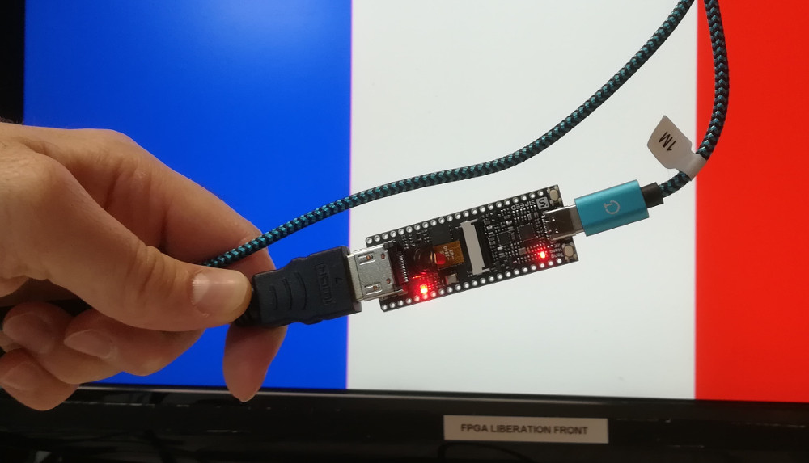

HDMI Chisel core 
================

This HDMI core is mainly inspired from
[vhdl-hdmi-out](https://github.com/fcayci/vhdl-hdmi-out) project.




# Install

To use it locally, first clone the repository then publish it locally :

```Shell
$ git clone https://github.com/Martoni/HdmiCore.git
$ cd HdmiCore
$ sbt publishLocal
```

HdmiCore use fpgamacro project to work. It must be published locally too :

```Shell
$ git clone https://github.com/Martoni/fpgamacro.git
$ cd fpgamacro
$ sbt publishLocal
```


On your personnal `build.sbt` project add the following line :

```Scala
    libraryDependencies ++= Seq(
//    ...
      "com.armadeus" %% "hdmicore" % "0.1.0"
    ),

```

# Generate simple pattern

## For TangNano4k

First launch sbt then generate simple pattern for [Tang Nano 4K board](http://www.fabienm.eu/flf/reception-du-kit-tang-nano-4k/):

```Shell
$ sbt
sbt:hdmicore> runMain hdmicore.platforms.TangNano4k
[info] running hdmicore.platforms.TangNano4k 
Elaborating design...
H_DISPLAY UInt<11>(1280)
V_DISPLAY UInt<10>(720)
hregsize 11
vregsize 10
Done elaborating.
```

A file named `TangNano4k.v` should be generated, it's the verilog file for the
entire project (the TOP component)

Then launch gowin_ide and create a project with fpga part named `GW1NSR-LV4CQN48PC7/I6`.
Once project created do not forget to activate `MODE` pin as a standard IO in menu 
`Project->Configuration->Dual-Purpose Pin` and select `use MODE as regular IO`.
It's for led blinking :)

Then finaly add these files (prefere to not copy in local directory):

```
TangNano4k.v
platforms/tangnano4k/tangnano4k.cst
platforms/tangnano4k/tangnano4k.sdc
```

Then launch synthesis and place&route

Finally flash your board with [openFPGALoader](https://github.com/trabucayre/openFPGALoader):

```Shell
$ openFPGALoader ide/tangnano4khdmi/impl/pnr/tangnano4khdmi.fs
write to ram
Jtag frequency : requested 6.00MHz   -> real 6.00MHz  
Parse file Parse ide/tangnano4khdmi/impl/pnr/tangnano4khdmi.fs: 
Done
DONE
Jtag frequency : requested 2.50MHz   -> real 2.00MHz  
erase SRAM Done
Flash SRAM: [==================================================] 100.00%
Done
SRAM Flash: Success
```

Plug HDMI then enjoy the result.


## For TangNano9k

First launch sbt then generate simple pattern for [Tang Nano 9K board](http://www.fabienm.eu/flf/deballage-de-la-tangnano9k/):

```Shell
$ sbt
sbt:hdmicore> runMain hdmicore.platforms.TangNano9k
[info] running hdmicore.platforms.TangNano9k 
Elaborating design...
H_DISPLAY UInt<11>(1280)
V_DISPLAY UInt<10>(720)
hregsize 11
vregsize 10
Done elaborating.
```

A file named `TangNano9k.v` should be generated, it's the verilog file for the
entire project (the TOP component)

Then launch gowin_ide and create a project with fpga part named `GW1NSR-LV4CQN48PC7/I6`.
Once project created do not forget to activate `MODE` pin as a standard IO in menu 
`Project->Configuration->Dual-Purpose Pin` and select `use MODE as regular IO`.
It's for led blinking :)

Then finaly add these files (prefere to not copy in local directory):

```
TangNano4k.v
platforms/tangnano9k/tangnano9k.cst
platforms/tangnano9k/tangnano9k.sdc
```

Then launch synthesis and place&route

Finally flash your board with [openFPGALoader](https://github.com/trabucayre/openFPGALoader):

```Shell
$ openFPGALoader ide/tangnano4khdmi/impl/pnr/tangnano9khdmi.fs
write to ram
Jtag frequency : requested 6.00MHz   -> real 6.00MHz  
Parse file Parse ide/tangnano4khdmi/impl/pnr/tangnano9khdmi.fs: 
Done
DONE
Jtag frequency : requested 2.50MHz   -> real 2.00MHz  
erase SRAM Done
Flash SRAM: [==================================================] 100.00%
Done
SRAM Flash: Success
```

Plug HDMI then enjoy the result.
